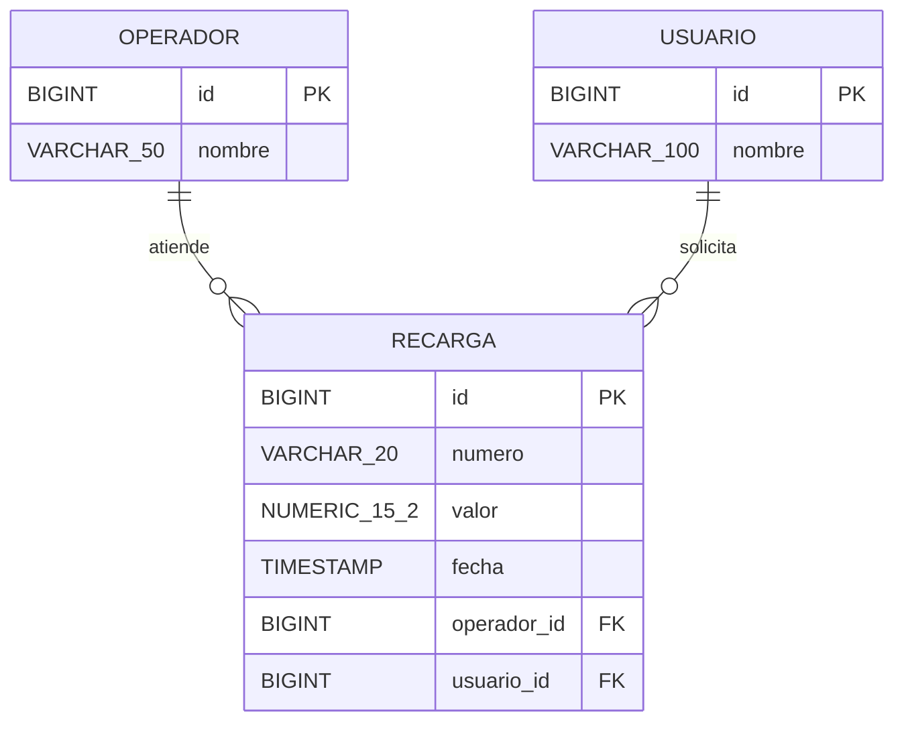
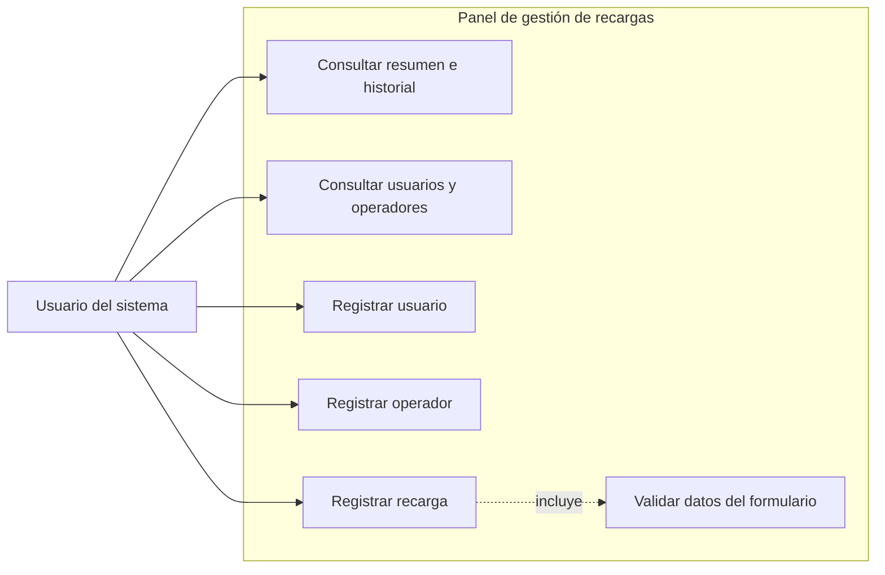
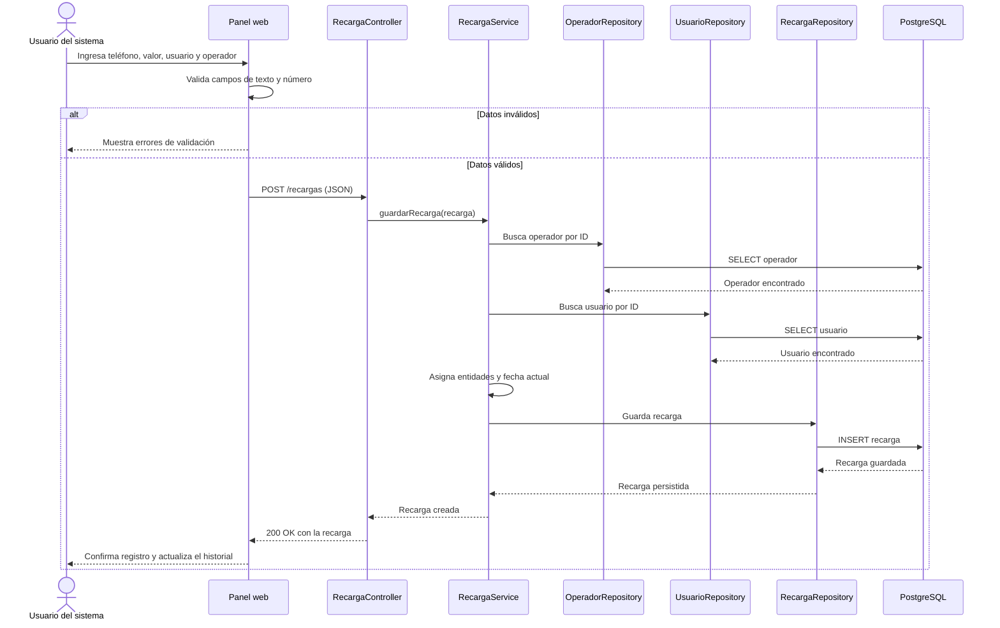
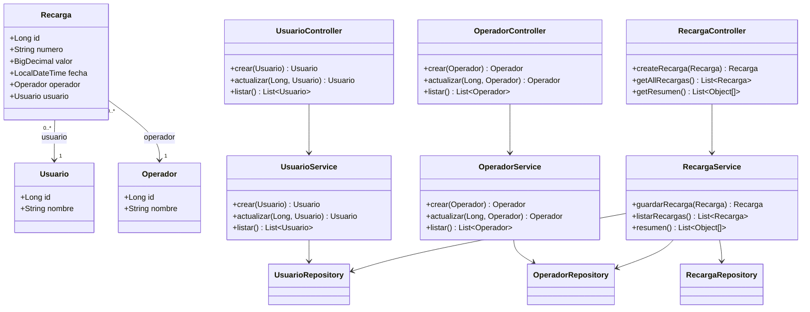

# Diagramas del sistema de recargas

Diagramas correspondientes a la implementación actual del proyecto. Se pueden visualizar en editores compatibles con Mermaid, por ejemplo GitHub o la vista previa de Markdown de VS Code.

## 1. Diagrama relacional

Representa las tablas PostgreSQL y sus claves. Una recarga puede asociarse con un usuario y un operador; tanto `operador_id` como `usuario_id` son claves foráneas.

## 2. Diagrama de casos de uso

El usuario del panel puede consultar información, mantener los catálogos y registrar recargas.

## 3. Diagrama de secuencia: registrar una recarga

El navegador valida los campos y envía el identificador del usuario y del operador seleccionados. El servicio busca esas entidades y guarda la recarga con la fecha actual.

## 4. Diagrama de clases

Resume las entidades, controladores, servicios y repositorios presentes en el código.

## Correspondencia con el código

- Entidades: `Usuario`, `Operador` y `Recarga`.
- Endpoints: `/usuarios`, `/operadores` y `/recargas`.
- La relación de `Recarga` con `Usuario` y `Operador` es de muchos a uno.
- Las validaciones básicas de nombre, teléfono y valor están actualmente en el front web.
